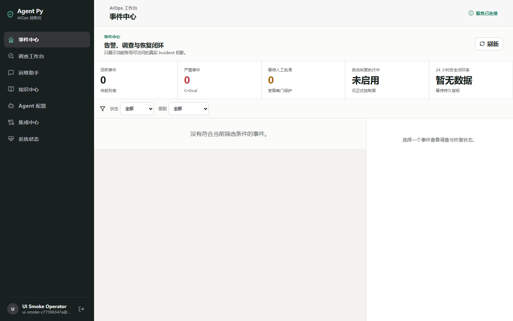
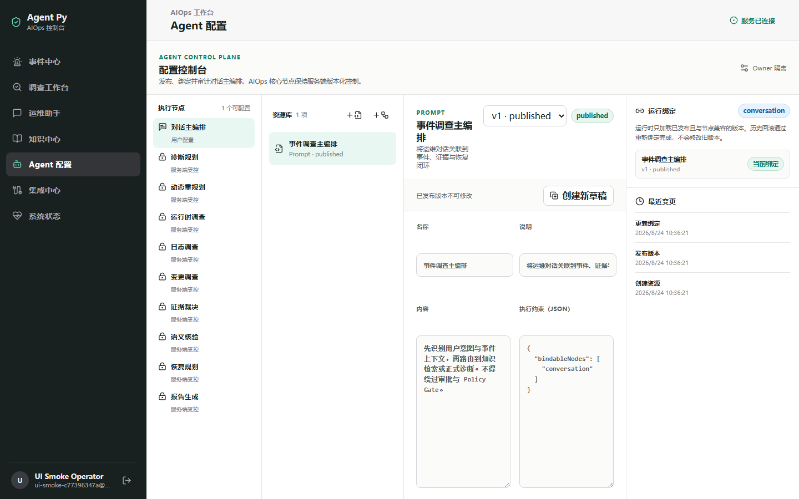

# Agent Py

[](https://github.com/tao943/agent-py-aiops/actions/workflows/ci.yml)


[](LICENSE)

Agent Py 是一个本地优先、可审计、可评测且恢复受治理的 AIOps Agent 工作台。
它把真实告警和运维对话连接到证据调查、根因裁决、安全恢复、结果验证与持久审计。



## 端到端闭环

```text
Alert 或 Chat 入口
→ Single/Multi-Agent 路由
→ CLS/PostgreSQL/Redis/Prometheus/RAG 证据
→ 证据聚合与根因裁决
→ Safety Validator / Policy Gate
→ 白名单自动恢复或人工审批
→ 恢复验证与全链路审计
```

Alertmanager 可以把活跃告警转换为事件；运维人员也可以在对话中查询事件、启动诊断或确认待办动作。
两个入口最终复用同一套 LangGraph AIOps 诊断链，不各自维护一套恢复逻辑。

## 核心能力

### 告警与对话入口

- 聚合 Alertmanager/Prometheus 告警并创建 owner-scoped 事件。
- Conversation Agent 支持流式回答、事件查询、诊断启动、状态查询和人工确认。
- 对话入口只负责路由、解释和确认；真实诊断继续由 AIOps Agent 完成。

### 证据驱动的 LangGraph 诊断

- Planner 根据公开症状与 RAG 知识生成调查计划。
- Executor 调用 CLS、PostgreSQL、Redis、Prometheus 和知识检索工具。
- Fact Adapter、Evidence Evaluation 与 Adjudicator 区分支持、反驳、缺失和不确定证据。
- Decision、Validator 与 Policy Gate 共同决定安全终态，报告结论可追溯到 Observation。

### Single/Multi-Agent 路由

- 默认使用延迟和成本更低的 Single-Agent 链路。
- 跨数据源且复杂度达到门槛时，可并行启动最多两个 Specialist。
- Specialist 共享受控任务上下文，通过 Evidence Aggregator 汇总事实，不共享隐藏推理。
- Multi-Agent 是否默认启用由持久化 A/B 指标决定，而不是为展示而强制开启。

### 混合 RAG 与可审计引用

- Milvus 向量召回与 BM25L 关键词召回并行执行。
- RRF 融合候选后使用 Qwen rerank 精排。
- 引用保留来源文档、chunk、向量/BM25/RRF/rerank 阶段排名和分数。
- owner、tenant、知识库和文档过滤贯穿写入与检索；无命中时不伪造引用。

### 受治理的恢复

- 恢复意图由服务端根据诊断结果生成，不能由模型文本直接获得执行权限。
- 只有证据充分、命中动作白名单、Validator 通过且 Policy Gate 许可的低风险动作才能自动执行。
- 高风险、证据不足、状态不确定或验证失败进入人工审批或人工复核。
- 恢复使用幂等键与独立 Verify，避免 Worker 重试导致副作用重复发生。

### 持久任务、审计与评测历史

- PostgreSQL durable job runtime 保存任务、事件、租约、重试、checkpoint 和取消状态。
- 工具调用、Evidence、假设裁决、报告、恢复意图和验证结果形成可查询审计链。
- Snapshot、Retrieval、Conversation 与 Live Artifact 可写入统一评测历史并生成聚合摘要。

## 评测体系

| 层级 | 版本化覆盖 | 主要验证内容 |
|---|---:|---|
| Snapshot | 10 个场景 | 确定性证据重放、诊断评分、答案隔离与安全终态 |
| Retrieval | 30 张卡 / 64 条查询 | 58 条有答案、6 条 no-answer；作用域检索与引用质量 |
| Conversation | 12 个离线 / 6 个模型 / 10 个重写案例 | 路由、最小工具、确认、安全门和多轮追问重写 |
| Docker Live | 5 个场景定义 | 真实故障注入、证据采集、恢复策略、Verify 与 Cleanup |

版本化场景存在，不代表每次运行都会执行自动恢复，也不代表每个场景都有当前成功的真实模型基线。
Live Eval 会区分恢复提案、人工审批、白名单动作和安全拒绝；真实运行结果与限制见
[AgentPy DomainBench](docs/aiops/agentpy-domainbench.md)。

Benchmark 答案、ground truth、oracle、provenance 和评分规则不会进入 Agent 可见 Prompt 或 RAG 知识库。
真实模型、CLS 与 Docker Live 运行必须显式确认，并会消耗外部服务额度与本机资源。

## 架构与技术栈

```text
Vue 3 + TypeScript
        ↓ HTTP / SSE
Nginx → FastAPI + Python
        ↓
LangChain Conversation Agent + LangGraph AIOps Agent
        ↓
PostgreSQL 16 / Redis 7 / Milvus / Alertmanager / Prometheus
        ↓
Tencent CLS MCP + OpenAI-compatible Qwen models
```

| 层级 | 组件 |
|---|---|
| 前端 | Vue 3、Vite、TypeScript、Pinia |
| API 与 Agent | FastAPI、Pydantic v2、LangChain、LangGraph |
| 数据与任务 | PostgreSQL 16、SQLAlchemy、Alembic、Redis 7 |
| 知识检索 | Milvus、BM25L、RRF、Qwen embedding/rerank |
| 可观测与工具 | Alertmanager、Prometheus、腾讯云 CLS MCP |
| 本地入口 | Docker Compose、Nginx、SSE |

详细组件边界、数据流与安全模型见[系统架构](docs/architecture.md)。



## 快速开始

先根据系统安装 Git、Docker、Node/npm、uv 与官方 `cls-mcp-server`：

- [Windows 安装](docs/setup/windows.md)
- [Linux 安装](docs/setup/linux.md)
- [macOS 安装](docs/setup/macos.md)

Docker Compose **只**负责 PostgreSQL、Redis、etcd、MinIO、Milvus、Attu、Alertmanager 和 Nginx 等本地基础设施；FastAPI 后端、Vue 前端与官方 CLS MCP Server 继续作为本机进程运行。

Windows PowerShell 从仓库根目录执行：

```powershell
if (-not (Test-Path 'config/project.json')) { Copy-Item 'config/project.template.json' 'config/project.json' }
if (-not (Test-Path 'config/user.project.json')) { Copy-Item 'config/user.project.template.json' 'config/user.project.json' }
docker compose -f infra/compose.yaml up -d postgres redis
scripts\start-local.bat
```

复制命令只在目标不存在时初始化配置，不会覆盖已有本地密钥或资源 ID。
请在被 Git 忽略的本地 JSON 中填写模型和 CLS 配置；缺少外部凭据时仍可运行离线测试，但真实模型与日志能力不可用。

macOS/Linux 使用相同的模板和 Compose 前置步骤，然后运行：

```bash
./scripts/start-local.sh
```

默认入口：前端 `http://127.0.0.1:5173`，Nginx API 网关 `http://127.0.0.1:8080`。
完整配置、健康检查和排障命令见[配置与监控](docs/operations-and-monitoring.md)。

## 文档

- [系统架构](docs/architecture.md)：组件、数据流、恢复治理、存储和部署边界。
- [评测体系](docs/aiops/agentpy-domainbench.md)：Snapshot、Retrieval、Conversation 与 Live 的规则和历史记录。
- [RAG 知识卡目录](docs/knowledge-catalog.md)：30 张通用差分排查卡。
- [配置与监控](docs/operations-and-monitoring.md)：配置字段、健康检查、指标和常见操作。
- [Live Eval 手册](docs/runbooks/live-eval.md)：故障注入、显式确认、验证与清理。
- [真实日志与告警](docs/tutorials/real-log-and-alert.md)：CLS、Alertmanager、SOP 与诊断演示。
- [多步骤 Skill 示例](docs/examples/skills/README.md)：日志分析、知识检索、变更风险与事故报告。

也可以运行 `npm run docs:dev` 在本地浏览精选 VitePress 文档站。

## 当前边界

- 当前推荐工作流是单台开发机上的本地进程与 Docker Compose，不包含 Kubernetes 或多区域高可用部署。
- 真实模型、CLS 和 Milvus 检索依赖本地配置及可用的外部服务；仓库不提交密钥或真实云资源 ID。
- 真实 Live Eval 需要显式批准额度、Docker 故障注入和 CLS 访问，默认 CI 只运行离线与合同测试。
- 恢复执行仅限服务端 allowlist 和受控参数合同，不提供任意 shell、任意 SQL 或任意服务重启。
- Multi-Agent 只在有可测能力增益时启用；供应商超时会进入可审计降级，而不是伪造成功结论。

## License

MIT — see [LICENSE](LICENSE).
