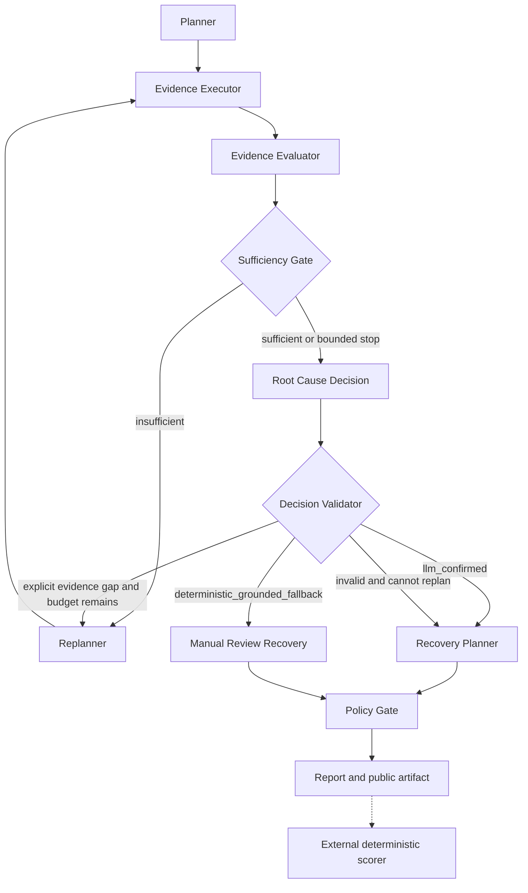

# AgentPy DomainBench：首个 Snapshot 诊断切片

当前版本已经打通“公开场景 → 冻结工具 → Agent 诊断 → 结构化证据链 →
确定性评分 → PostgreSQL 留档”的最小闭环。它用于比较 Agent 版本，不是
OpenSRE 官方 Benchmark，也不使用 OpenSRE 的评分体系。

## 当前十个 Snapshot 场景

当前目录包含 `APY-002`、`APY-003`、`APY-006`、`APY-007`、`APY-011`、
`APY-012`、`APY-013`、`APY-014`、`APY-015` 和 `APY-016`。其中 PostgreSQL 和
Redis 各有一对公开输入相同、真实原因不同的差分案例：

| 场景对 | 公开现象 | 需要通过证据区分的方向 |
|---|---|---|
| APY-002 / APY-011 | 请求等待 PostgreSQL 连接超时 | 数据库事务/锁占用，或应用连接生命周期异常 |
| APY-007 / APY-012 | 应用 Redis 请求失败 | Redis 服务不可用，或服务恢复后客户端池未恢复 |

新增的四个场景分别覆盖 PostgreSQL deadlock、Redis maxclients、Nginx upstream
response timeout 和 HTTP 429 retry storm。它们复用通用知识卡，但不向 RAG 导入
Snapshot、oracle 或覆盖映射。

所有扩展场景均为 `agentpy-original` Snapshot，只冻结本项目综合公开资料后构造的观测，
不声明为博客原样复现，也没有对应 Live 故障注入。每个 oracle 至少要求两个来自不同
工具的证据里程碑，并要求排除一个最强替代原因；无关弱干扰项不得进入正确因果链。

### Nginx 首个差分切片

`APY-003` 和 `APY-006` 都表现为 Nginx checkout upstream 返回 HTTP 502，
但正确根因不同：

| 场景 | 故障组件 | 主要机制 | 区分证据 |
|---|---|---|---|
| APY-003 | `checkout-service` | 进程不可用 | 容器退出，8080 无监听；Nginx 连接被拒绝 |
| APY-006 | `nginx-gateway` | upstream 端口不匹配 | checkout 健康监听 8080；Nginx 指向 8081 |

两者的 `provenance.yaml` 均标记为 `agentpy-original`。场景来自本项目的
Docker Compose/Nginx 拓扑和项目自有 fixture，不应描述为 OpenSRE-derived。
同一告警现象必须通过证据排除另一种候选原因，不能靠告警名称直接匹配答案。

## Snapshot 与答案隔离

每个场景包含以下文件：

- `scenario.yaml`：Agent 可见的告警、候选假设和 Snapshot 路径。
- `snapshot/tool_responses.yaml`：按工具名和精确参数冻结的只读观测。
- `ground_truth.yaml`：仅 evaluator 可读的根因、必要证据和排除项。
- `provenance.yaml`：来源、验证参考和许可证说明。

Snapshot 不启动故障容器，也不访问 CLS、Alertmanager、Docker、Milvus 或真实业务
服务。`SnapshotMcpClient` 只重放场景中注册的工具与参数，未知工具或不同参数会
直接失败。Runner 先把 `PublicScenario` 和 Snapshot MCP 交给 Agent，Agent 返回
`RunArtifact` 后 evaluator 才读取 `ground_truth.yaml`。该文件不得进入 Prompt、
RAG、MCP、诊断报告或业务 API。

公开 RAG 只允许收录通用差分排查卡。`scenario.yaml`、Snapshot 响应、
`ground_truth.yaml`、provenance、Retrieval 查询标签和评分规则都不得导入知识库。
PostgreSQL 与 Redis 各使用一张综合卡，让 Agent 根据收集到的证据区分多个原因，
而不是为每个场景提供一张答案卡。

默认 pytest 使用脚本化 adapter 验证整个隔离和评分合同，不调用真实 DashScope：

```powershell
cd apps/backend
uv run pytest tests/test_snapshot_benchmark_runner.py tests/test_evaluation_scoring.py -q
```

脚本化 adapter 只存在于测试文件，不能从 CLI 选择，避免把伪造诊断结果当作真实
Agent 能力。

## 使用 application adapter 运行

application adapter 复用现有 `AiopsDiagnosticService`、LangGraph workflow、
PostgreSQL repository 和本地项目配置。它会调用所配置的真实 Chat 模型，因此会
消耗模型额度；运行前需要 PostgreSQL 已启动、Alembic 已升级，并在 Git 忽略的
本地配置中提供有效模型配置。

### 证据驱动诊断工作流

`evidence-driven-v3` 不再按固定步骤直接生成结论。每轮工具观测先形成结构化
Evidence，再更新公开候选假设，判断当前证据是否足以区分根因；证据缺口明确且预算
仍可用时才进入 gap-targeted replanner。



初始计划最多 4 步；所有已持久化的 Executor 尝试合计最多 6 次，重复步骤、参数校验
失败和工具失败同样消耗预算；最多允许 2 次 replan。Decision Validator 先执行公开、
确定性的证据绑定检查，再调用结构化 LLM Validator。模型调用失败、格式错误、明确拒绝和
候选缺失分别记录为 `model_call_failed`、`invalid_model_output` / `retry_exhausted`、
`model_rejected` 和 `candidate_missing`，不得把基础设施故障伪装成证据缺口。

v3 只有两种可进入 Artifact 的有效来源：`llm_confirmed`，或候选通过全部公开确定性检查后
因 Validator 不可用形成的 `deterministic_grounded_fallback`。后者必须进入
`manual_review`，Policy Gate 保持 `executionPermitted=false`；如果候选混入 Alert、RAG、
其他任务或非 supporting Observation 的 Evidence ID，则禁止降级并 fail closed。历史
`evidence-driven-v2` 仍按 `decision_validation.status=valid` 读取，旧运行不会因新增 origin
字段而失去可评分性。

Recovery Planner 只生成结构化建议。`proposal_only` 工具必须由本次请求显式加入
白名单、符合发现到的 JSON Schema，并且要求人工审批；Policy Gate 的 `allowed` 只表示
“无副作用提案已记录并完成审计”，`executionPermitted` 始终为 `false`，不代表配置写入、
reload、restart 或其他基础设施变更获批。PostgreSQL 与 Redis 的真实恢复仍由 Agent 图
之外的确定性 Live Recovery Policy 重新校验和执行。

确定性 scorer 位于 LangGraph 之外，只读取完成后的结构化 Artifact 与 evaluator 私有
答案；它不会把 ground truth、评分失败或恢复 oracle 反馈给 Planner、RAG、Prompt、
Checkpoint 或报告。

```powershell
cd apps/backend
uv run alembic upgrade head
uv run python scripts/run_snapshot_benchmark.py --scenario APY-003 --suite-version v1 --runs 1 --adapter application --output var/benchmarks/APY-003.json
uv run python scripts/run_snapshot_benchmark.py --scenario APY-006 --suite-version v1 --runs 1 --adapter application --output var/benchmarks/APY-006.json
```

CLI 输出 UTF-8 JSON，包括 scenario、run ID、六个维度、总分、失败分类、硬门槛、
有效性、是否通过、耗时和逐项 `ScoreReason`。退出码含义：

- `0`：有效且通过。
- `1`：运行有效但案例未通过。
- `2`：答案访问、评测无效或基础设施失败。

## 评分与通过条件

当前只有项目自有的 `deterministic_score`，满分 100：

| 维度 | 分值 |
|---|---:|
| 结果与闭环 | 20 |
| 根因诊断 | 25 |
| 证据与因果链 | 20 |
| 调查决策过程 | 15 |
| 恢复安全性 | 15 |
| 效率与稳定性 | 5 |

总分不是唯一通过条件。组件和主要机制必须正确，所有必要证据里程碑必须由已持久化
证据满足，并且不能触发硬门槛。读取 ground truth 会使运行 `invalid`；执行 L3、
未审批 L2、未验证 L1 会失败；引用不存在的证据会把证据分归零并把总分封顶为 59。
评分器只读取结构化 artifact，不扫描 Markdown 报告，也不保存模型私有思维链。

## PostgreSQL 审计链

PostgreSQL 是评测事实源，Redis 不参与评分正确性。`aiops_evaluation_runs` 保存场景、
suite、Agent/Git 版本、安全的模型元数据、状态和关联诊断任务；
`aiops_evaluation_results` 一对一保存分项得分、总分、有效性、失败项和评分理由。
模型配置明确拒绝 `api_key`、secret、token、password 等字段。

拿到 CLI 输出的 run ID 后，可先定位诊断任务，再查看执行链：

```sql
SELECT run_id, scenario_id, status, diagnostic_task_id, created_at, completed_at
FROM aiops_evaluation_runs WHERE run_id = '<run-id>';

SELECT sequence, phase, status, payload
FROM aiops_diagnostic_steps WHERE task_id = '<diagnostic-task-id>' ORDER BY sequence;

SELECT id, kind, source, summary, payload
FROM aiops_diagnostic_evidence WHERE task_id = '<diagnostic-task-id>' ORDER BY created_at;

SELECT tool_name, status, arguments, result_summary, duration_ms
FROM tool_call_audits WHERE diagnostic_task_id = '<diagnostic-task-id>' ORDER BY created_at;

SELECT checkpoint_ns, checkpoint_id, checkpoint_payload
FROM aiops_graph_checkpoints WHERE task_id = '<diagnostic-task-id>' ORDER BY created_at;
```

这些记录组成可审计决策链：计划步骤说明调查目的，工具审计记录实际调用，Evidence
保存裁剪后的事实，evidence-evaluation 步骤记录证据支持/反驳哪些候选假设，decision
步骤只允许引用数据库中已存在的 evidence ID。

## 如何根据失败调优

先保存当前 Git commit 的 baseline，再按 `failures` 和 `ScoreReason` 定位单一变量：

- `required_evidence_missing`：补充或调整工具规划，不能改答案匹配规则来送分。
- `required_rule_out_missing`：让 replanner 显式检查最强替代原因。
- `primary_mechanism_wrong`：改进候选假设区分和 evidence evaluator。
- `fabricated_evidence`：收紧 decision 校验，禁止引用未持久化 ID。
- `bounded_plan`/`bounded_tool_calls` 丢分：减少重复、无区分力的工具调用。

一次只修改 Workflow、Prompt、Tool 或 RAG 中的一个主要变量；先重跑目标场景，再跑
另一个同症状场景检查回退。比较时同时记录 Git SHA、模型配置、suite version、分项
得分、失败分类与工具调用数，不能只比较最终总分。

## Retrieval Eval

`docs/knowledge-candidates` 当前包含 30 张原创差分排障卡；其中 PostgreSQL deadlock、
Redis maxclients 和 Nginx upstream timeout 三张卡已通过隔离 Docker Live 验证，其余
27 张卡保持 `docker_validation: pending`。六个运维章节进入向量索引，来源和验证状态仅
保留在 PostgreSQL 完整原文与 metadata 中。当前 audit 预期共 180 个 Chunk。

`benchmarks/agentpy/retrieval/queries.yaml` 保存 64 条经过审核且不含场景答案的查询：
58 条有答案查询覆盖全部 30 张卡，6 条无答案探针用于观察知识域外查询的 Top-1 分数与
Top-2 margin。探针不进入 Recall/MRR 分母，也不影响退出码，只有得到独立校准集后才设置
拒答阈值。
纯评分器计算：

- `Document Recall@1` 与 `Document Recall@3`：Chunk hits 按来源文档首次出现去重后，目标卡是否进入前 1/3；
- `MRR`：第一条相关文档的平均倒数排名；
- `forbiddenTopOneRate`：明确不应第一名的异类卡是否错误占据 Top-1；
- `citationCompletenessRate`：每个返回结果是否具有 Chunk、文档、知识库、向量分和重排分。

Retrieval Eval 不评价诊断正确性。它只验证问题能否在严格 owner/知识库范围内检索到
合适的通用知识，以及引用信息是否可审计；根因、证据链和恢复安全仍由 Snapshot 的
`deterministic_score` 评价。

真实检索必须显式提供 owner 和知识库，按顺序执行 64 条查询以控制额度：

```powershell
cd apps/backend
uv run python scripts/run_retrieval_benchmark.py --owner-user-id <owner-id> --knowledge-base-id <kb-id> --output var/benchmarks/retrieval-64-2026-08-14.json
```

该命令调用真实 Embedding、Milvus 和 Rerank，消耗对应额度但不调用 Agent Chat，且不
属于普通 CI。JSON 只保存排名来源、Chunk/文档/知识库 ID、分数、模型名称和耗时；
正文、excerpt、API key 与原始配置不会写入报告。任一 hit 越过 owner/tenant/KB 边界会
在评分前失败。

更新两张知识卡时，batch importer 仍使用 `overwrite=true`。同 owner、同知识库、同
文件名即使正文改变，也会先删除被替换文档的 Milvus chunks，再 soft-delete 旧记录并
创建新文档；不同文件名不会互相替换。若历史数据已经有多个同名当前记录（现行状态为
`ready`，并兼容旧 `active`），应先人工审计，不允许 importer 静默批量删除。

Agent RAG before/after 对比在 30 卡导入与 64-query Retrieval Eval 通过后执行。对比固定
场景、模型、Prompt、Workflow 和 Tool，仅改变 RAG 开关；不能为了改善结果修改标签、
Prompt 或评分规则。

### 历史两卡 smoke 基线（2026-08-13）

在本地测试 owner 的隔离知识库中，仅更新 PostgreSQL 与 Redis 两张综合卡后执行了一次
六查询真实基线。Embedding 使用 `qwen3.7-text-embedding`，Rerank 使用
`qwen3-vl-rerank`；结果为 `Recall@1=1.0`、`Recall@3=1.0`、`MRR=1.0`、
`forbiddenTopOneRate=0.0`、`citationCompletenessRate=1.0`。PostgreSQL 中旧文档已
soft-delete，新文档为 indexed；Milvus 中新文档各有两个 chunk，旧文档均无残留 chunk。
原始安全报告保存在本地 Git 忽略的 `apps/backend/var/benchmarks/retrieval-v1.json`，
不提交 owner、知识库和文档 ID。

该结果仅证明真实服务链路可用，不代表 30 卡难度下的正式基线。新版门禁为有答案查询
`Document Recall@1 >= 0.80`、`Document Recall@3 >= 0.95`、`MRR >= 0.85`、
`forbiddenTopOneRate <= 0.05`、`citationCompletenessRate = 1.00`。30 卡真实导入与
60 查询真实结果必须在离线回归后另行执行，失败时保留 bad cases，不修改标签送分。

### 30 卡真实 Retrieval 基线（2026-08-13）

30 张卡已导入隔离知识库：PostgreSQL 中 30 个批准文件各有且仅有一个 ready/indexed
记录；Milvus 共 180 个 scoped Chunk，每文档 6 个，owner/tenant/KB 越界为 0，来源与
验证状态 Chunk 为 0。Embedding 使用 `qwen3.7-text-embedding`，Rerank 使用
`qwen3-vl-rerank`。一次 60 查询真实运行得到：

- `Document Recall@1 = 0.9259`；
- `Document Recall@3 = 1.0000`；
- `MRR = 0.9599`；
- `forbiddenTopOneRate = 0.0185`；
- `citationCompletenessRate = 0.9833`。

前四项通过，旧 citation 门禁失败。三个返回 hit 是 RRF 中合法的 BM25-only 候选：具有
BM25、RRF 与 rerank 证据，但不在 vector Top-20，因此 `vectorScore` 为空；其中两个来自
有答案查询，一个来自无答案探针。这不是 citation 映射丢失。Citation audit 已改为按
实际参与通道检查 rank/score 一致性，并继续要求稳定 ID、RRF 与 rerank 证据；不填充
伪造的 0 分，不过滤 lexical-only hit，也不修改检索排名。vector、BM25 与 hybrid 覆盖率
作为诊断字段单独报告，不参与通过门禁。原始报告位于 Git 忽略的
`apps/backend/var/benchmarks/retrieval-30-card-v1.json`。本阶段未运行 Docker 故障实验，
全部知识卡继续保持 `docker_validation: pending`。

### 2026-08-14 Snapshot/Retrieval corpus expansion

- Snapshot fixtures：10 个（`APY-002`、`APY-003`、`APY-006`、`APY-007`、
  `APY-011` 至 `APY-016`）。
- 通用知识卡：保持 30 张，没有增加与场景一一对应的答案卡。
- Retrieval queries：64 条，其中 58 条有答案、6 条 no-answer probe。
- `snapshot_knowledge_coverage.yaml` 仅供 evaluator 校验覆盖完整性，不进入 importer、
  Prompt、Agent Artifact、报告或 Milvus。
- 60 问真实 Retrieval 结果保留为历史基线；64 问结果见下一节，不能用离线合同测试
  冒充真实指标。

### 30 卡、64-query 真实 Retrieval 基线（2026-08-14）

导入后审计确认 PostgreSQL 为 30 个 `ready/indexed` 文档、30 个不同文件名、0 个当前
同名重复；Milvus 为 180 个 scoped Chunk、30 个文档、每文档 6 个 Chunk，且 owner、
tenant、KB、文档关联错配均为 0。Embedding 使用 `qwen3.7-text-embedding`，Rerank 使用
`qwen3-vl-rerank`。64 条查询顺序执行约 11 分 19 秒，得到：

- `Document Recall@1 = 0.9310`；
- `Document Recall@3 = 1.0000`；
- `MRR = 0.9626`；
- `forbiddenTopOneRate = 0.0172`；
- `citationCompletenessRate = 1.0000`；
- vector、BM25、hybrid channel coverage 分别为 `0.9844`、`0.7083`、`0.6927`。

全部正式门槛通过。以下表格保留 4 个 Top-1 bad case；排名为目标 hit 与错误 Top-1 hit 的
`vector/BM25/rerank` 排名，`-` 表示该召回通道未参与。查询原文与 Chunk 内容不进入公开
报告，相关性标签也未因结果而调整。

| Query | 目标文档 | 去重后的文档顺序 | 目标排名 / Top-1 排名 | Forbidden Top-1 | 分类 |
| --- | --- | --- | --- | --- | --- |
| `RET-A-001` | `nginx-upstream-timeout.md` | `microservice-timeout.md` → `nginx-upstream-timeout.md` | `v6/b-/r3` / `v4/b-/r1` | 否 | `vector_recall` |
| `RET-L-010` | `postgres-disk-wal-pressure.md` | `postgres-replication-lag.md` → `postgres-disk-wal-pressure.md` | `v1/b-/r2` / `v4/b-/r1` | 否 | `rerank_order` |
| `RET-L-011` | `redis-unavailable.md` | `redis-failover-reconnect.md` → `redis-unavailable.md` → `postgres-connectivity-auth.md` | `v2/b6/r2` / `v1/b-/r1` | 是 | `rerank_order` |
| `RET-X-002` | `service-circuit-breaker-degradation.md` | `redis-failover-reconnect.md` → `nginx-upstream-502.md` → `service-circuit-breaker-degradation.md` | `v19/b7/r3` / `v9/b-/r1` | 否 | `rerank_order` |

`RET-A-001` 的目标仅以较低向量位次进入候选且无 BM25 信号，因此分类为
`vector_recall`；其余三个目标在候选阶段已有可审计信号，但 rerank 将其排在错误文档
之后，分类为 `rerank_order`。原始安全报告位于 Git 忽略的
`apps/backend/var/benchmarks/retrieval-64-2026-08-14.json`。

### 四场景 Snapshot RAG off/on 基线（2026-08-15）

固定 Git SHA `0be29cff1ad9485be3712559a01eebe538edb608`、suite `v1`、Workflow
`agentpy-domainbench-v1`、Prompt 源码、`qwen3.7-plus` Chat 模型、场景文件和 30 卡
目录后，对 `APY-013` 至 `APY-016` 各顺序运行一次 RAG off/on。下表中的工具数按持久化
证据关联的不同 `tool_call_id` 计算；Citation 列只统计授权知识库的
`knowledge_reference`，不包含场景 Snapshot 证据。

| 场景 | 模式 | 总分 | Outcome / Diagnosis / Evidence / Process / Safety / Efficiency | 工具数 | Citation | 耗时 |
| --- | --- | ---: | --- | ---: | --- | ---: |
| `APY-013` | off | 38 | 12 / 0 / 0 / 8 / 15 / 3 | 1 | 0 | 167.843s |
| `APY-013` | on | 32 | 12 / 0 / 0 / 0 / 15 / 5 | 0 | 3，`postgres-deadlock.md` | 184.793s |
| `APY-014` | off | 38 | 12 / 0 / 0 / 8 / 15 / 3 | 1 | 0 | 172.210s |
| `APY-014` | on | 38 | 12 / 0 / 0 / 8 / 15 / 3 | 1 | 3，`redis-maxclients-pressure.md` | 214.223s |
| `APY-015` | off | 38 | 12 / 0 / 0 / 8 / 15 / 3 | 1 | 0 | 174.479s |
| `APY-015` | on | 38 | 12 / 0 / 0 / 8 / 15 / 3 | 1 | 3，Nginx timeout/502 差分卡 | 236.716s |
| `APY-016` | off | 32 | 12 / 0 / 0 / 0 / 15 / 5 | 0 | 0 | 104.452s |
| `APY-016` | on | 38 | 12 / 0 / 0 / 8 / 15 / 3 | 1 | 3，`http-rate-limit-retry-storm.md` | 172.819s |

八次运行均为 `VALID_FAIL`，共同失败项为 `missing_root_cause_decision` 和
`required_evidence_missing`；安全维度均为 15，未出现 forbidden claim 或 hard gate。
RAG on 的 12 条 Citation 均属于指定 owner/KB，未发现 `ground_truth`、`primary_cause`、
oracle 或覆盖映射字段。RAG off 的知识引用数均为 0。`APY-013` 开启 RAG 后下降 6 分，
`APY-016` 上升 6 分，其余持平，因此当前数据不能支持“RAG 普遍提升诊断”的结论。

`APY-014` 第一次 RAG-on 尝试遇到 rerank 暂时不可用，只生成检索错误占位；该报告被保留
为 retrieval infrastructure invalid，不进入上表，随后重跑得到 3 条有效 Citation。
这暴露出一个有效性缺口：Snapshot CLI 当前不会把 RAG 子系统失败提升为 exit 2，后续
应在比较门禁中修复。当前持久化结构也未记录 token usage，因此不能把模型用量写成 0；
这里只记录模型名称与实际总耗时。

### Snapshot Tool Calling 参数所有权

Snapshot 中的资源标识、采样窗口和冻结查询范围由评测运行时拥有，不再要求模型精确复述。
加载场景时，运行时会从公开的注册调用中派生固定字段和合法变体；Planner、Replanner 与
Executor 使用同一规范化和 JSON Schema 校验路径。模型仍负责选择工具、诊断目的、候选假设
和真正存在的多调用变体，例如上游目标或 retry-policy 视图。

这不是答案注入：参数契约不包含 `evidence_id`、工具结果、根因、恢复动作或 ground truth。
规范化后仍由 Snapshot MCP 做精确调用匹配，任意或近似参数不会获得证据。审计保存的是实际
发送给 MCP 的有效参数，规范化后重复的调用不会消耗六步执行预算；绕过 Planner 的非法旧
状态会在创建 MCP 审计前以有限 `invalid_arguments` 错误拒绝。

真实模型验收必须按顺序执行：先运行 `APY-013`；只有它达到既有阈值，才依次抽验
`APY-014`、`APY-015` 和 `APY-016`。不得为通过验收修改答案、评分权重或阈值。

### APY-013 resilient validation 验收（2026-08-16）

在 30 个 `ready/indexed` 知识文档和 RAG on 条件下只运行一次真实 `APY-013`，未自动
重试。运行耗时 336,212 ms，总分 89，`validity=valid`、`passed=true` 且无 hard gate。
三个必需证据里程碑、独立正证据、根因 component/mechanism 和安全边界均通过。

本次 LLM Validator 调用不可用，但候选通过全部十项公开确定性检查，因此审计记录为
`validationOrigin=deterministic_grounded_fallback`、
`validationErrorCategory=model_call_failed`。Workflow 没有进入无关 Replan，Recovery 被
强制为 `manual_review`，Policy Gate 记录 `manual_review_required` 且
`executionPermitted=false`，验证了降级闭环不会授权自动恢复。

剩余扣分为 `trigger_wrong` 和 `causal_chain_incomplete`，属于生成语义与评分标签的后续
调优范围。`observations_evaluated` 也未得分：本次有四个 Executor / Evidence Evaluation，
但 Artifact 同时把一次 `knowledge_retrieval` 审计计入五个 completed tool calls，现有规则
要求 Observation 数量不少于全部 completed tool calls，因而产生口径偏差；该评分口径需
在独立变更中区分知识检索与可形成 Observation 的诊断工具，不能通过修改本次答案或阈值
处理。

### APY-013 Validator 与评分修复验收（2026-08-17）

本轮实现提交为 `1d486f9`、`9944433`、`e433098` 和 `3ed0218`：过程评分仅要求完成的
诊断工具具有 Evidence Evaluation；Validator 模型失败使用允许列表错误码和阶段；Snapshot
与 Live 共用有序语义评分；公开 Observation 增加 `trigger/mechanism/impact/context` 因果
角色，grounded fallback 仅在存在唯一证据绑定 trigger 时生成 2～6 项有序因果链。

离线验证仅运行受影响的十个专项测试文件，没有运行全量 pytest；拆分后的两组专项回归、
Ruff、Pyright 和变更规格 `harden-aiops-decision-validation --strict` 均通过。全局 OpenSpec
校验仍有 13 个未被本轮修改的历史规格质量警告，例如 `agent-tool-call-audits` 的 Purpose
长度不足；这些警告不属于本轮代码变更。

前置审计确认 30 个知识文档均为 `ready/indexed`，三个真实 LLM readiness 测试通过，
Archive 无 checksum conflict。在 RAG on 条件下只执行一次真实 `APY-013`，run ID 为
`eval-528fbe19193743b18cb90fb6f1eaf0c7`，耗时 306,822 ms。运行终态已同时写入
PostgreSQL 与 Archive，审计为 27 个 artifact、27 个 checksum、0 pending、0 conflict。

本次结果为 `validity=valid`、`passed=false`、总分 50，维度为
`12 / 0 / 10 / 8 / 15 / 5`。`observations_evaluated=5/5`，证明
`knowledge_retrieval` 不再占用诊断 Observation 配额。三个必要证据里程碑、安全边界和工具
预算均通过，但没有产生 Root Cause Decision，因此失败项为
`missing_root_cause_decision`。

脱敏步骤审计显示三次 Evidence Evaluation 均完成，但真实模型将三条 Observation 全部
标为 `mechanism`，没有唯一 `trigger`。LLM Decision 随后得到
`decisionErrorCategory=invalid_model_output`；grounded fallback 按 fail-closed 合同拒绝从
任意 mechanism 或公开 hypothesis description 猜测 trigger。Validator 因候选缺失记录
`candidate_missing`，Recovery/Policy 保持 deferred 且 `executionPermitted=false`。因此本次
未触发 Validator 模型调用，不能用它评价 Validator 供应商稳定性。

下一轮应增强公开因果角色合同的确定性，而不是放宽评分或 fallback：让诊断计划为每个
Evidence Evaluation 提供可审计的预期因果角色，并在 Observation 写入前校验角色与计划目的
一致；角色冲突时进入受限修复或人工复核。该改造需保持 Ground Truth 隔离，不能把 evaluator
rubric、正确根因或场景答案注入 Agent Prompt。

### APY-013 causal intent routing 验收（2026-08-17）

本轮设计与计划提交为 `10c72c0`、`b631cb7` 和 `ae44108`；实现提交为 `fa888e6`、
`52be2d0`、`8bac75f`、`ae615a8`、`c947a5d`、`74e9338` 和 `1d5ac82`。Planner/
Replanner 现在为每个诊断步骤保存 `causalIntent` 及来源，Evidence Evaluation 按 Plan 合同
归一化 `trigger/mechanism/impact/context`，Sufficiency、Decision 和 Validator 只接受证据绑定
且角色完整的唯一根因。Observation 的 `supports/refutes` 也被限制在当前步骤
`testsHypotheses` 内，模型不能越权修改未测试 hypothesis。

本阶段只运行一次真实 `APY-013`，run ID 为
`eval-247b1751764e40c08fd9a7f0b4cde4f0`，耗时 322,545 ms。结果为
`validity=valid`、`passed=false`、总分 50，维度为 `12 / 0 / 10 / 8 / 15 / 5`，失败项为
`missing_root_cause_decision`。三个必要证据、`observations_evaluated=5/5`、Ground Truth 隔离、
恢复安全和工具预算均通过；Recovery 为 `no_action`，Policy 为 `no_grounded_action`，
`executionPermitted=false`。

安全步骤审计确认 Planner 已形成完整角色覆盖：PostgreSQL Error 为 impact、Wait Graph 为
mechanism、Resource Order 为 trigger、Metrics 为 context，前三条 Observation 也正确形成
impact/mechanism/trigger。随后真实 Sufficiency 仍继续执行 Metrics；Metrics 模型输出越权
refute 了当前步骤未测试的三个 hypothesis，导致唯一支持假设消失。Decision structured 调用同时
记录 `model_call_failed/provider_4xx`，Validator 因候选缺失记录 `candidate_missing`。因此这次
50 分反映两项独立问题：Observation hypothesis 越界更新，以及 structured-output 方法与当前
DashScope 模型不兼容。

修复后，模型 capability profile 显式声明 `structuredOutputMethod`；当前本地
`qwen3.7-plus` 使用 LangChain `json_mode`，旧 profile 缺失字段时保持
`function_calling` 兼容。一个只含合成公开事实的最小真实 structured Decision readiness 在
24.1 秒内通过，没有读取真实日志、隐藏答案或 Ground Truth。离线 Group A 137 项、Group B
148 项、provider/Decision/config 57 项均通过，Ruff clean、Pyright 0 errors，聚焦 OpenSpec
strict valid。Archive 当前为 28 个 artifact、28 个 checksum、0 conflict、0 pending。

上述两项修复完成后没有再次运行 `APY-013`，因此不能宣称真实 Benchmark 已达标；后续真实
验收必须在新的明确授权下执行，并保留新 run，而不是覆盖或重标本次失败结果。

### APY-013 确定性 Sufficiency 与 Decision 规范化（2026-08-17）

本轮设计/计划提交为 `e7528e8`、`9884505` 和 `4ae907e`；实现与回归提交为
`2e19a7e`、`0588d20`、`1cde2af` 和 `432ae32`。Sufficiency 的 supported、refuted 与
unresolved 分类现在只由公开 Hypothesis 全集和持久化 Hypothesis State 派生；模型输出只保留
缺失证据、推荐工具和公开摘要建议。缺失、重复或非公开状态会 fail closed，非公开 ID 不写入
审计。存在 open competitor 时，Workflow 优先执行 `testsHypotheses` 与其相交的未运行 Plan
Step，无匹配步骤才进入有界 Replan。

Decision 在 LLM Validator 前新增全有或全无的公开证据规范化。只有原 Candidate 通过标签、
Evidence 归属、唯一 supported、无 open competitor 等检查，且失败项仅为
`trigger_present`/`grounded_causal_chain` 时，系统才使用 Candidate 已引用的 supporting
Observation summary 重建 trigger 与因果链。规范化结果必须再次通过原十项确定性 Validator；
Candidate 未引用链条所用 Observation Evidence、多 trigger、角色不完整或标签错误时不修补。
Validator、评分阈值和恢复权限均未降低。

离线 APY-013 application 回归现在按顺序执行四个诊断工具：PostgreSQL Error、Wait Graph、
Database Metrics 和 Resource Order。Database Metrics 真实 refute `postgres_slow_query` 后，
系统才关闭最后一个 competitor；随后生成 `decisionOrigin=llm_grounded_normalization`，确定性
验证通过，恢复 Policy 仍为 `executionPermitted=false`。

本轮只运行受限回归，没有运行全量 pytest：Group A 90 项、Group B 111 项全部通过；Ruff
clean、Pyright `0 errors`、`harden-aiops-decision-validation --strict` valid、`git diff --check`
通过。本轮没有再次执行真实 LLM APY-013，因此不新增真实分数或达标声明；下一次真实验收仍需
单独授权并保存为新的独立 Run。

### 独立 qwen3.8-max Validator readiness（2026-08-18）

主 Agent 继续使用 `qwen3.7-plus`；只有语义 Decision Validator 使用 `qwen3.8-max`。两者复用
现有 DashScope API Key、Base URL、timeout 与 retry 配置，并分别使用各自 capability profile
中的 `json_mode`。历史配置缺少 `validatorModel` 时兼容回退主模型；配置了模型但缺少 capability
profile 时 fail closed。

Validator Prompt 现在包含明确的 JSON 指令和只描述形状的安全示例。structured parse 失败可审计
区分非法 JSON、envelope、缺字段、枚举、容器、额外字段、非当前任务 Evidence ID 和兼容回退；
Step、Checkpoint 与 Run Artifact 仅保存允许列表模型名和错误分类，不保存 Prompt、原始响应、
异常正文、字段值、凭据、Ground Truth、Oracle 或原始 CLS 日志。确定性 Validator、Benchmark
权重/阈值、Policy Gate 与恢复权限均未改变。

本轮没有运行全量 pytest。离线 Group A 115 项、Group B 88 项全部通过；随后只运行一次使用
虚构公开事实和虚构 Evidence ID 的真实 Validator readiness，`qwen3.8-max` 在约 16 秒内通过
Pydantic Schema 并返回 `valid`。该 readiness 未读取 APY、RAG、CLS 或 PostgreSQL 诊断证据，
也没有运行 APY-013，因此没有产生新的 Benchmark 分数或达标声明。

### Nginx LLM + CLS 正式验收（2026-08-20）

`APY-LIVE-NGINX-TIMEOUT-001` 的正式 Run ID 为
`accept-apy-live-nginx-timeout-001-1787183288`。本次使用 30 卡 active/indexed 知识库、真实
CLS 证据源和 `evidence-driven-v4` Workflow，结果为 `VALID_PASS`、总分 100、raw total 100，
没有 hard gate 或失败项；Diagnostic Task 为 `succeeded`，Evaluation Run 为 `passed`，
Artifact checksum 已持久化。总耗时 143,924 ms。

本次 Agent 完成 `knowledge_retrieval`、三个 Nginx 只读工具、`SearchLog` 和无副作用
`ProposeNginxTimeoutMitigation`，六条工具审计均为 `completed`。可信公开事实模式形成唯一
upstream response timeout 根因和完整 trigger/mechanism/impact；未调用 Adjudicator、Replanner
或 LLM Validator。模型角色只有 Planner、Recovery Planner 和同步 Report，共三次调用；Report
由 LLM 生成。Validator Router 记录 `validationRequired=false` 和 `no_semantic_risk`。

Recovery 保持 `proposal_only`，Policy Gate 仅记录供人工审阅的提案：
`proposalRecorded=true`、`executionPermitted=false`，没有修改或 reload Nginx。独立 Verify 与
Cleanup 均通过，Nginx 配置 diff 为 0。历史审计为 85 个 Artifact、85 个 checksum、0 conflict、
0 database pending。本轮关键修复提交为 `39dc6e9` 和 `0716c84`；只运行目标回归，没有运行
全量 pytest。

### Single/Multi 数据源路由 A/B（2026-08-20）

本轮新增 Benchmark-only `--strategy single|multi`、请求/实际策略审计、可从
PostgreSQL 终态重建的定长指标，以及只读 Runtime/Log fan-out。普通诊断 API 仍固定
`auto`，生产 Router policy 默认 `multi_agent_enabled=false`；只有显式 Benchmark Multi
才临时开启 Multi 候选，且不能绕过 capability、deadline、预算、两轮上限或恢复门禁。

固定 campaign `route-ab-20260820` 使用同一 Git 工作树、30 卡 active/indexed KB、模型配置、
CLS 证据源和工具白名单。Nginx timeout 得到三次真正 Single 与三次真正 Multi 的完整配对：

| 指标 | Single | Multi | 门禁结果 |
| --- | ---: | ---: | --- |
| 有效 Run | 3 | 3 | 6/6 `VALID_PASS` |
| 平均总分 | 100 | 100 | 无下降 |
| Root Cause Top-1 | 100% | 100% | 增益 0 个百分点 |
| Evidence Recall | 100% | 100% | 增益 0 个百分点 |
| P50 / P95 | 152,694 / 176,330 ms | 169,608 / 172,314 ms | Multi P95 为 Single 的 0.977 倍 |
| 每次模型调用 | 2 | 2 | 额外调用 0 |
| 最大重复 Evidence | 0% | 0% | 通过 |
| 安全硬门禁 | 3/3 通过 | 3/3 通过 | 通过 |

Single Run 为 `route-ab-nginx-single-01-20260820`、`-02-`、`-03-`；对应 checksum
分别为 `004af1af...e7a2`、`67651110...abf`、`da2f9118...a2f9`。Multi Run 为
`route-ab-nginx-multi-02-20260820`、`-03-`、`-04-`；checksum 分别为
`3d497a38...a115`、`011ac487...7170`、`4ad6eca3...7f39`。六次均无 fallback，
cleanup 和独立验证通过。

第二场景未形成可发布配对。PostgreSQL 行锁的三次 `--strategy multi` 因 Planner 未形成
两个可信并行数据域，Router 按 `insufficient_parallel_sources` 保持 effective Single；其中
`route-ab-pglock-multi-03-20260820` 为 73 分 `VALID_FAIL`，不能挑选性重跑覆盖。Redis
`route-ab-redis-multi-01-20260820` 实际执行 Multi，但在恢复边界以
`recovery_denied/redis_decision_required` 结束，cleanup 成功，未进入完整 evaluator 终态。
这些结果证明硬门禁有效，但不能被计为完整 Multi A/B 样本。

发布判定为 `benchmark_only`：Nginx 性能、模型预算、重复 Evidence 和安全门禁均通过，
但 Evidence Recall 与 Root Cause Top-1 均无能力增益；同时缺少第二个完整有效场景。未降低
评分阈值、required Evidence、Validator 或恢复授权规则。生产 `auto` 不默认升级 Multi。

### Order API 连接池生命周期 Live 合同（2026-08-20）

新增 `APY-LIVE-ORDER-POOL-LEAK-001`，实现提交基线为 `4b0c2be`。隔离
`live-eval-order-api` 使用固定容量 asyncpg pool 和 `agent_py_live_eval` 中的 run-scoped 测试订单；
异常订单路径在 checkout 和真实参数化更新后进入错误分支并有界保留连接。Runtime 证据只证明池饱和、
业务 acquire timeout、PostgreSQL 可达和无锁等待；CLS records 来自 order-api `/events` 的真实
checkout/error/checkin/timeout 生命周期，不使用 evaluator 合成答案。

Docker run `docker-order-pool-contract` 已验证：基线订单更新成功、3 个异常连接累积、池 free 为 0、
业务探针超时、旧 generation 连接在 scoped restart 后释放、新 generation ready、业务更新恢复、测试订单
删除、双 cleanup 和最终 audit clean。首次运行发现 Compose restart 完成早于 HTTP ready，现已加入有界
健康轮询；知识卡 `postgres-pool-exhaustion.md` 只标记为本隔离 order-api fixture 已验证，不外推到所有
连接池实现。

目标回归、Ruff、Pyright、Compose config 与 OpenSpec strict validation 均通过，未运行全量 pytest。
Single 与 Multi 的 Runtime/CLS 工具、可信参数和评分器相同；并行 Dispatch 共享一次全局模型预算，
不能给每个 Investigator 复制额度。尚未执行真实 LLM+CLS 3×3 A/B，因此当前只能证明场景、路由和安全
闭环成立，不能宣称 Multi-Agent 具有能力增益或适合生产默认启用。

### Order Pool hypothesis-coherent 修复 canary（2026-08-20）

提交 `7076304` 完成了三项安全修复：计划覆盖必须围绕同一公开 hypothesis；Live 工具角色、公开
hypothesis 能力与 Generic Plan 共同读取单一 capability registry；Order Pool mechanism/impact 只能由
incident-scoped CLS lifecycle、连接池满载、run-scoped PostgreSQL 会话、数据库可达和业务 acquire
timeout 的结构化组合事实投影。普通 summary、neutral/error observation 或仅排除竞争候选的 Evidence
不再被升级为正 Evidence；未修改 Validator、评分、独立 Evidence 门槛或恢复授权。

本地受控模型为 `qwen3.7-plus` 与 `qwen3-vl-rerank`，独立 Validator 和 embedding 保持不变。真实模型
readiness 2/2、真实 CLS upload/search contract、30 documents/180 chunks RAG scope audit、目标 pytest、
Ruff 与 Pyright 均通过；未运行全量 pytest。

唯一 Single canary `order-pool-causal-single-canary-20260820-125754` 在 Agent/LLM 诊断前以
`VALID_FAIL/fault_injection_failed` 终止，`diagnosticTaskId=null`，因此不能用于评价本次因果链修复。
失败终态同时保存到 PostgreSQL 与 Evaluation Archive，artifact checksum 为
`496026c2c2bda37555c2211e3dad095dd4c02a8b66a5f6a31876456d23b671a5`；首次 Verify 检测到残留，随后
显式 Cleanup 成功并持久化 `cleanupSucceeded=true`。旧失败 Run
`order-pool-q3r-ab-single-01-20260820` 的 checksum、result identity、失败分类与 cleanup 终态保持不变。

后续不自动重跑第二个付费 canary。真实 Docker 合同复查显示 fault injection 可复现通过，但恢复后的
`unrelated_sessions_preserved` 仍以瞬时 session 数完全相等作为条件，会受并发 observer/health connection
波动影响。应先单独加固该 Live harness 的稳定身份/集合比较，再经确认运行新的唯一 Single canary；
在此之前不得开始 3×3 A/B，也不得宣称真实修复已达到 `VALID_PASS`。

提交 `d0e90a5` 将 order-api 空闲池连接标记为 `agentpy-order-api:idle`，observer 排除所有
`agentpy-order-api:%` 会话，并以 `pid + backend_start` 稳定身份和 baseline 子集语义验证真正的无关会话；
瞬时新增 observer 会话不再造成误判，baseline 无关会话丢失仍会失败。16 项目标测试、Ruff、Pyright 和
真实 Docker 恢复合同均通过，未运行全量 pytest。

随后唯一 Single canary `order-pool-causal-single-canary-20260820-220146` 仍在 Agent/LLM 前以
`VALID_FAIL/fault_injection_failed` 终止，`diagnosticTaskId=null`。三次 fault 请求及 probe/state 请求均到达
order-api，但当前失败 Artifact 未持久化六项注入检查的逐项安全结果，因而不能据此确定是哪一项检查发生
波动，也不能评价因果链修复。独立 Verify 先发现残留，显式 Cleanup 后通过并持久化
`cleanupSucceeded=true`；PostgreSQL Artifact checksum 为
`26d167ea22c5c656e3693e0999c4cccf50e4bbda3f9cee164afeaf116031314e`。此前两个失败 Run 的 checksum、
result identity、失败分类与 cleanup 终态保持不变。下一步应先为注入失败持久化允许列表内的 check 名称、
布尔结果和安全事实，再凭证据修复具体波动；在此之前不再运行付费 canary 或 3×3 A/B。

提交 `8ce6c43`、`753c9e3` 与 `c51dca3` 完成上述可观测性链路。未确认的
`LiveFaultObservation` 现在通过类型化、不可变的安全诊断携带有序 `checkResults`、由 false 检查严格
投影的 `failedChecks` 和 driver 显式声明的标量 `safeFacts`；完整结构进入同一个 v1 terminal Envelope，
由 Archive-first recorder 同步到 Evaluation Archive 与 PostgreSQL JSONB。CLI 与本地 report 只公开经过
重新规范化的失败检查名称，不公开完整事实。

Runner 构造、Artifact 反序列化和 report 读取共同使用一套数量、唯一性、标识符、有限数值、标量类型与
禁用答案/凭据字段校验；三项诊断字段必须同时存在，`failedChecks` 必须与 false 检查的原顺序完全一致。
inject 在返回 Observation 前直接异常时不伪造诊断；恶意、嵌套、重复、超长、非有限或结构不一致的内容
被省略或拒绝，同时保留原失败分类和 cleanup 语义。目标 Runner/CLI/history/archive/recording/persistence/
Order Pool contract 回归、精确本地失败路径、Ruff 与 Pyright 均通过；未运行全量 pytest、真实 LLM、CLS、
Docker 或新的付费 canary。因此前一 canary 的具体波动原因仍未知，下一条经批准的唯一 canary 才能用新
Artifact 给出具体失败检查。

### Order Pool PostgreSQL session scope 修复与唯一 canary（2026-08-20）

失败 Run `order-pool-diagnostics-single-20260820-225508` 的安全诊断确认仅
`run_scoped_sessions_present=false`：3 个连接已 checkout、pool capacity 为 3、free 为 0、业务探针
超时、PostgreSQL 可达且无锁等待，但 observer 看到的当前 Run 会话数为 0。根因是原标签
`agentpy-order-api:<full_run_id>:<full_generation>` 超过 PostgreSQL `application_name` 的 63 字节上限，
服务端在 generation 前截断，而 observer 仍按完整 Run ID 与 generation 查询。

提交 `386690e` 将仅用于 PostgreSQL session 的标签改为
`agentpy-order-api:<sha256(run_id)[:16]>:<generation[:16]>`，最长 51 个 ASCII 字节；HTTP、订单、事件、
CLS、Artifact 与 PostgreSQL 评测历史中的完整 Run ID 不变。order-api 与 backend observer 使用相同算法，
run pattern 和 generation 精确匹配均有 64 字符 Run ID 合同覆盖。19 项定向单元测试、Ruff、Pyright 与
重建镜像后的真实 Docker 恢复/幂等清理合同通过；未运行全量 pytest。canary 前置审计同时确认
30 documents/180 chunks/0 scope mismatch、主模型与独立 Validator readiness 2/2，旧失败 Run 的
`VALID_FAIL/fault_injection_failed` 状态及 checksum
`17ddbe924a1ed34ecca638c088962e40763a3f22a46afd1aafa8b1880097e42d` 未改变。

唯一真实 Single canary `order-pool-bounded-single-20260820-231711` 已越过 fault injection 硬门禁；按
Runner 控制流，这意味着 `pool_at_capacity`、`pool_free_zero`、`business_probe_timed_out`、
`postgres_reachable`、`no_lock_wait` 和 `run_scoped_sessions_present` 六项均为 true。随后真实诊断任务
`diagnostic_904360a7dcc74d5ab25f2e3878aca18d` 成功完成，`evidence-driven-v4` 收集 4 条 Evidence、执行
5 次模型调用，但以 `rootCauseDecision=null`、`terminationReason=no_useful_step` 结束；确定性 Validator
给出 `invalid/deterministic_gap`，Recovery Plan 为 `no_action`，Policy 为
`no_grounded_action` 且 `executionPermitted=false`。因此 Live 运行安全终止为
`VALID_FAIL/recovery_denied`，授权码为 `order_pool_decision_required`，不能据此执行自动恢复。

该 terminal Envelope 已同时保存在 Evaluation Archive 与 PostgreSQL，checksum 为
`82f86cf339a2fa5f3bd0ffd1776c135dbf53269da954f768e3a9148877b273a4`。失败后独立 Verify 检出残留，
随后 scoped Cleanup 返回 `verificationPassed=true`、`cleanupSucceeded=true`，最终 audit clean；终态
Envelope 保持不可变，独立清理结果不会回写并改变上述 checksum。按一次 canary 约束未运行第二次。
本次结果证明 session scope 修复有效，但尚未证明 Agent 根因决策与自动恢复闭环通过；下一轮应单独分析
`no_useful_step/deterministic_gap`，不得通过放宽恢复授权或评分门槛绕过。

### Order Pool trusted lifecycle 真实 Single 门禁（2026-08-21）

真实 Run `order-pool-specialist-single-gate-20260821` 使用 CLS 与 active indexed 的
30 documents/180 chunks 知识作用域，完成诊断任务
`diagnostic_28cef91204ff45e0bf4e3eb0c031516a`。运行收集 4 组独立工具 Evidence；池满、空闲连接 0、
waiter、run-scoped sessions、PostgreSQL 可达、无锁等待和业务探针超时均成立。CLS 生命周期包含一组
先完成归还的正常 checkout/checkin，之后才出现未归还 checkout、更新失败与 acquire timeout。

该 Run 执行 5 次模型调用后仍以 `rootCauseDecision=null`、`terminationReason=no_useful_step` 结束，
Recovery Policy 安全拒绝执行（`no_grounded_action`、`executionPermitted=false`），Live 终态为
`VALID_FAIL/recovery_denied`，cleanup 成功。terminal Envelope 位于外部 Evaluation Archive，checksum 为
`f5dd60342e23f8f156e87b676f686f4587d2f620ec52647ab1b2d5d1cc4368c3`；失败终态保持不可变。

根因不是 LLM、RAG 或 CLS 缺证据，而是 trusted lifecycle matcher 将任意位置出现的
`connection_checkin` 都当作冲突，误伤了泄漏链之前已经闭合的正常请求。matcher 已改为按
`checkout ... order_update_failed ... pool_acquire_timeout` 窗口判断，仅当该候选 checkout 到 timeout
之间没有 checkin 时才匹配；泄漏窗口内 checkin 仍 fail-closed。新增真实前序形态回归后，Order Pool
trusted/fact/adjudication/live contract 定向测试、生产图定向测试、Ruff 与 Pyright 均通过。按一次
canary 约束尚未执行修复后的第二次真实 Run，也未开始 Specialist Multi-Agent 实现。

修复后的真实 Single Run `order-pool-specialist-single-gate-fixed-20260821` 已成功形成
`deterministic_grounded` 根因决策，并由 deterministic Validator 判定 valid。决策 component 为
`order-api`、mechanism 为 `exception_path_connection_not_released`，引用 4 组独立工具 Evidence；恢复、
独立验证和 cleanup 均成功，安全硬门禁通过，Evidence Recall 为 100%，运行耗时 195161 ms。

该 Run 的原始总分为 90，终态仍为 `VALID_FAIL`，失败项是
`primary_trigger_unsupported`、`causal_chain_incomplete` 和 `primary_root_cause_wrong`。根因是 trusted
pattern 的确定性投影只陈述了观察到的事件和池状态，没有显式表达“exception path”、未释放连接导致池耗尽、
以及新订单等待连接后超时的因果关系；component、mechanism、证据、恢复和安全策略均正确。terminal
Envelope checksum 为 `1f7cd23049a073439a23cc87a52e085021962d13e7443b99dc6913c4465aa132`，
其诊断任务为 `diagnostic_7a850951612e4ecdb62ed54432c39119`，不可覆盖。

新增 production trusted-pattern semantic contract 后，旧投影稳定复现 10/20；随后仅将已有证据明确投影为
trigger/mechanism/impact，并为 mechanism 与 impact 补齐相应 Evidence 引用，合同达到 20/20。Ground Truth、
评分器、同义词表、总分阈值、恢复授权和安全门禁均未修改。此修复目前只有离线验证，尚未执行新的真实
Single Run，也未开始 Specialist Multi-Agent 实现。

最终真实 Single 门禁 `order-pool-specialist-single-gate-semantic-fixed-20260821` 达到
`100/100`、`VALID_PASS`，无失败项。Root Cause Top-1、Evidence Recall、恢复验证、cleanup 和安全硬门禁
全部通过；运行耗时 206829 ms，Archive 口径成功模型调用数为 3，Evidence 无重复。对应诊断任务
`diagnostic_d879de6b40484420a3bfbd26d834f20e` 收集 8 条持久化 Evidence、4 个独立
`sourceFingerprint`，匹配 `order_connection_checkout_without_checkin`；Decision 来源为
`deterministic_grounded`，deterministic Validator 判定 valid，根因为
`order-api / exception_path_connection_not_released`。

生产 Recovery Policy 仍保持 `manual_review_required`、`executionPermitted=false`；本次 executed recovery
仅由隔离 Live Benchmark harness 按场景合同执行并独立验证，不改变生产自动恢复授权。terminal Envelope
checksum 为 `a85abec8ce1398080506dda21ecf91a6b75d93725aeeea660c32ce10ba85412e`。
该结果完成 Specialist Multi-Agent 实现前的 Single 门禁。

### Order Pool Specialist 真实 3×3 Single/Multi A/B（2026-08-21）

真实验收 campaign 为 `order-pool-specialist-ab-20260821-555c1aff`。六次运行均使用
`eval-user`、`kb-30-cards`、CLS、相同项目配置与模型覆盖，按 Single 01～03、Multi
01～03 顺序执行，未并发注入故障。生产 `auto` 路由始终保持 Single/shadow；Multi 仅由
Benchmark forced mode 触发。

| 策略 | Run ID | 终态 | 诊断耗时 ms | Root Cause Top-1 | Evidence Recall | 独立来源组 | 成功/失败模型调用 | Specialist 状态 | Archive checksum |
| --- | --- | --- | ---: | ---: | ---: | ---: | --- | --- | --- |
| Single | `order-pool-specialist-ab-single-01-20260821` | `100/100 VALID_PASS` | 206872 | 是 | 100% | 4 | 3/0 | 不适用 | `0ebb21ed77458ab8c37941f887a0e326e62ac635c76c78f2827dbb230082cbc1` |
| Single | `order-pool-specialist-ab-single-02-20260821` | `100/100 VALID_PASS` | 200881 | 是 | 100% | 4 | 3/0 | 不适用 | `6ab267272e35fc47591559c00254be3c8754b29fd7da5d3773a53adf6c8bfee5` |
| Single | `order-pool-specialist-ab-single-03-20260821` | `100/100 VALID_PASS` | 192259 | 是 | 100% | 4 | 3/0 | 不适用 | `b8312c2bb6b8098c9ef5169686411f1e8e733b78ad05c772a81c9a9185860bd6` |
| Multi | `order-pool-specialist-ab-multi-01-20260821` | `VALID_FAIL / recovery_denied` | 94770 | 否 | 0% | 0 | 1/2 | Runtime、Log 均 failed | `8dfdeadede4883fe5b768cb94005e281ea8bf2a6fb2cd159812d4836cd97b9e8` |
| Multi | `order-pool-specialist-ab-multi-02-20260821` | `VALID_FAIL / recovery_denied` | 94886 | 否 | 0% | 0 | 1/2 | Runtime、Log 均 failed | `a78eed2318e47a0844deeaaf331fb2900abd78cff46c29ea93170d2828165e95` |
| Multi | `order-pool-specialist-ab-multi-03-20260821` | `VALID_FAIL / recovery_denied` | 106542 | 否 | 0% | 0 | 1/2 | Runtime、Log 均 failed | `d9a093acd3b4be37a0c047e1f779cab7b8de6ff8ce0ef89a54c60cbbad7dc2a5` |

Single 的平均诊断耗时为 200004 ms，nearest-rank P95 为 206872 ms；Multi 平均为
98733 ms，P95 为 106542 ms。Multi 的低耗时不构成性能收益，因为它在 Specialist Local
Plan 阶段提前失败。Single 三次均完整形成 trigger、mechanism、impact 因果链，无重复
Evidence，恢复、独立验证、安全硬门禁与 cleanup 全部通过。Multi 六个 Specialist 角色执行
全部失败，失败率 100%；每次只有中央 Planner 的一次成功模型调用，Runtime 与 Log Local Plan
各一次模型调用均返回 `provider_4xx / model_call_failed`，没有进入工具调用。聚合器三次均确定性
生成 `multi_investigation_failed`，`missingDomains=[log,runtime]`、`sourceGroupCount=0`、
`conflictCount=0`，随后生产恢复策略以 `order_pool_decision_required` 拒绝执行。三个 Multi Run
均显式再次执行幂等 cleanup 并返回 clean，没有发生不安全恢复或跨 Run 清理。

本轮同时暴露一个持久化缺口：成功路径的固定 A/B 指标完整进入 terminal Envelope；
`recovery_denied` 失败路径只在 terminal Envelope 保存 `cleanupSucceeded=true`，没有投影
`diagnosticTaskId` 与 Specialist 指标。三次 Multi 的角色状态、预算、缺失域和 aggregation
checksum 仍完整保存在 PostgreSQL Diagnostic Step/checkpoint，失败 terminal 本身保持不可变，
没有为补数据而重写归档。后续应先用测试驱动补齐 Live 失败路径的安全指标投影，再进行新的
Multi 复验。

结论：Multi 不满足“不降低 Root Cause Top-1 且至少提升一项能力指标”的门槛，当前仅保留
Benchmark forced mode，生产自动 Multi 继续禁用。修复供应商结构化 Local Plan 请求兼容性后，
仍需新的、单独批准的 A/B campaign；本轮结果不能作为默认启用依据。

### V4 Structured LLM Validator 真实 Multi canary（2026-08-21）

真实 Run `v4-structured-validator-multi-20260821203446` 使用 CLS、forced Multi、主模型
`qwen3.7-plus`、独立 Validator `qwen3.8-max`，两者均按配置使用 `json_mode`。运行达到
`100/100 VALID_PASS`，Root Cause Top-1 正确、Evidence Recall 100%、4 个独立来源组、无重复
Evidence，恢复验证、安全硬门禁和 cleanup 全部通过；诊断耗时 360417 ms，总模型调用数为 8。
Runtime Specialist 收集 3 条 Evidence、调用 3 个工具，Log Specialist 收集 1 条 Evidence、调用
1 个 CLS 工具；两个角色虽因各自局部模型边界记录为 inconclusive，聚合后的确定性证据仍完整支持根因。

Validator Router 仅因 `execution_requested` 选择语义门，证明低风险 proposal-only 路由未被改为强制调用。
Validator 第一次结构化调用耗时 23973 ms，请求成功但 Schema 解析失败；格式纠正后的第二次调用受全局
剩余硬截止限制，28293 ms 后以 `timeout/model_invoke` 结束。持久化 Step 与 Checkpoint 均记录
`validationOrigin=llm_failed`、`semanticValidationAttempts=2`、`validationModel=qwen3.8-max`、
`validationErrorCode=timeout`，Policy Gate 保持 `executionPermitted=false`。Live Benchmark harness 按隔离
场景合同完成恢复验证不代表生产 Agent 获得自动执行权限。

该不可变 terminal Envelope 位于外部 Evaluation Archive，SHA-256 为
`225479eefefcc693a0d12784332f3561e16ac5855e228b94212ad50247015cac`，诊断任务为
`diagnostic_9fa11787dd7d457d995c3359dfd673d1`。终态后再次独立执行 Verify 与幂等 Cleanup，分别返回
`verificationPassed=true` 和 `cleanupSucceeded=true`。随后离线回归补充了“第一次解析错误 + 最终调用错误”
的有界错误历史保留；历史真实 Envelope 不回写，未来 Run 将同时保留两阶段安全错误码。

针对该 canary 暴露的格式纠正问题，V4 Validator 现复用一份严格公开输出合同：固定五字段、
`valid/invalid` 枚举、数组和空数组语义、禁止额外字段，并附不含真实 Evidence 的合成 JSON 示例。
第一次 structured parse 失败后，只有 hard deadline 至少还剩 60 秒 Validator role timeout 加
5 秒调度余量时才允许一次纠正重试；否则不调用供应商、不消耗第二次模型预算，保存首次 parse code
和 `retry_skipped_insufficient_deadline`，继续保持 `manual_review` 与
`executionPermitted=false`。该行为已通过 60/65 秒冻结时钟边界、Artifact allowlist、Ruff、Pyright
和 focused OpenSpec 离线验证；尚未用新的真实 Run 宣称供应商 Validator 已恢复稳定。

随后真实 Run `v4-validator-contract-canary-20260821-1787319745759` 使用 CLS、forced Multi、
主模型 `qwen3.7-plus` 和独立 Validator `qwen3.8-max` 完成 `100/100 VALID_PASS`。运行耗时
360432 ms，总模型调用数 7，Root Cause Top-1 正确、Evidence Recall 100%、4 个独立来源组、
无重复 Evidence，恢复验证和安全硬门禁通过。Validator Router 因 `execution_requested` 开启；
Validator 首次结构化调用在 28560 ms 内返回 `llm_semantic/valid`，
`semanticValidationAttempts=1`，没有 parse、timeout 或 retry 错误。Policy Gate 仍返回
`external_policy_required` 与 `executionPermitted=false`，证明语义核验成功没有绕过恢复授权。

该不可变 Envelope 的 SHA-256 为
`103bb05c322ea03252f8606243f3471a85c248d3ca6aa551f2a2710a9a113211`，诊断任务为
`diagnostic_b1affce557654ef98049451adac1018b`。终态后再次独立执行 Verify 与幂等 Cleanup，均返回
clean，最终 `verificationPassed=true`、`cleanupSucceeded=true`。本次结果证明精确输出合同在该真实
canary 上首次成功，不代表所有供应商响应或未来场景均不会触发 deadline-aware 安全降级。

## 当前阶段边界

### PostgreSQL CLS Multi 离线路由回归（2026-08-20）

公开 PostgreSQL Lock hypotheses、项目内 `docker-live-postgres` Runtime 工具和受作用域约束的
CLS `SearchLog` 可形成 `runtime + log` 两个可信 Dispatch；Benchmark forced Multi 的离线路由结果为
`multi_agent`。该测试不调用 Oracle、真实 LLM 或 CLS，只证明路由可用性；真实能力增益与生产默认启用
仍需完整 A/B 门禁。

Snapshot 已扩展到十个，Retrieval 标签已扩展到 64 条。Live 已包含 PostgreSQL 行锁、
PostgreSQL deadlock、Redis maxclients 与 Nginx timeout 四个隔离场景；driver、证据工具、
清理和执行恢复/人工审批边界已经实现并通过顺序 Docker 验证。64-query 真实 Retrieval
基线和四个 Snapshot 的 RAG off/on 已经完成；真实 LLM+CLS 验收仍属于后续验证阶段。

### 四场景 Docker Live 验证（2026-08-14）

| 场景 | 恢复合同 | 已验证的安全检查 |
| --- | --- | --- |
| PostgreSQL 行锁 | `executed_recovery` | 真实阻塞、作用域恢复、业务探针、幂等清理 |
| PostgreSQL 死锁 | `executed_recovery` | 等待环、数据库回滚、仅重试受害事务、幂等清理 |
| Redis maxclients | `executed_recovery` | 新连接拒绝、既有连接健康、当前运行连接清理、无关连接保留 |
| Nginx upstream timeout | `proposal_only` | 真实 504、直接上游健康、零写执行、配置不变、幂等清理 |

最终隔离审计为 PostgreSQL 当前运行会话 0、fixture 表 0、Redis 当前运行命名连接 0、
Nginx 配置变化 0，四个依赖均健康。`postgres-deadlock.md`、
`redis-maxclients-pressure.md` 和 `nginx-upstream-timeout.md` 已据此标记为
`docker_validation: verified`；未实际复现的知识卡继续保持 `pending`。

## 首个 Docker Live 场景

`APY-LIVE-PG-LOCK-001` 将 Snapshot 评测扩展为真实 PostgreSQL 行锁实验：注入器在
`agent_py_live_eval` 创建当前 run 独占表和 blocker/waiter 会话；collector 向 Agent
仅暴露等待事件、阻塞边和健康探针，不暴露 DSN、SQL、application name、PID 所有权或
oracle。Agent 仍运行生产 `AiopsDiagnosticService` 与现有 30 卡 RAG。

恢复边界只允许 `terminate_postgres_backend`，并在执行前重新校验数据库、当前 run 的
application name、注入记录 PID、waiter 阻塞边、executor/waiter/system 排除项。大范围
或非 synthetic 会话只能生成审批方案。恢复后必须验证 blocker 消失、waiter 解锁、锁图
清空、业务探针成功、PostgreSQL 健康且无关会话未受影响；所有路径最终进行 scoped、
幂等清理。

Live 满分 100：故障确认 10、必要证据 20、多候选差分排查 15、主根因 20、Citation/
工具审计 10、恢复策略 10、恢复验证 15。ground truth 访问、非白名单动作、跨 run 终止、
未验证恢复、残留 blocker、cleanup 失败或 scope 隔离失败均为硬门禁。普通 CI 默认排除
`live_docker`，CLS collector 延后，真实模型 Live Eval 只能手动触发。
## Live CLS 证据覆盖

`APY-LIVE-PG-LOCK-001` 支持两种显式证据源。`local` 用于离线开发和 CI；`cls` 将本次运行的
结构化业务日志上传到真实腾讯云 CLS，并要求 Agent 通过官方 MCP `SearchLog` 使用相同
`run_id`、`scenario_id` 和 `incident_id` 的日志。CLS 只证明请求错误和时间线，PostgreSQL
会话与锁图仍负责证明等待事件和阻塞关系。

CLS 接入不增加分数。有效的 CLS 运行继续使用相同 100 分模型，但必需证据和引用审计必须
同时包含 CLS 与 PostgreSQL 来源。云端或审计基础设施失败标记为 `INFRA_INVALID`；Agent
未调用工具、查询范围错误或未引用证据标记为 `VALID_FAIL`。

## Conversation 三层 Eval 与 Chat Live 入口

Conversation 与 AIOps 使用三层、职责分离的验收方式：

| 层级 | 真实模型 | CLS / Docker | 验证目标 |
| --- | --- | --- | --- |
| Offline Conversation Eval | 否 | 否 | 路由、最小工具、确认、幂等、隔离、预算与安全硬门 |
| Conversation Model Eval | 是 | 否，AIOps Bridge 为 fake | 模糊路由、结构化解释、超时降级、Prompt Injection |
| Chat→AIOps Live Eval | 是 | 是 | 从对话确认入口复用完整 Live 诊断、恢复和评分闭环 |

Chat Live 的执行顺序固定为：Live harness 注入故障并准备 scoped CLS → Chat 创建 Pending
Action → 人工确认 → evaluation-only durable worker → 现有
`ApplicationLiveDiagnosticAdapter` → AIOps CLS/RAG/LangGraph/Recovery/Scorer。Chat 的工具
列表不包含 CLS；显式 Incident ID 可确定性路由，因此 Conversation 侧模型调用数允许为 0，
但确认后的 AIOps 诊断仍使用原场景、原证据上下文和原评分器。

手动命令从 `apps/backend` 执行：

```powershell
uv run python scripts/run_conversation_model_eval.py --confirm-real-model
uv run python scripts/run_chat_aiops_live_eval.py --scenario APY-LIVE-PG-LOCK-001 --owner-user-id <owner-id> --knowledge-base-id <kb-id> --confirm-real-model --confirm-live-cls
```

Chat Live 同时要求 `--confirm-real-model` 和 `--confirm-live-cls`，场景 ID 只接受 registry 中的
`APY-LIVE-*` 标识并拒绝路径穿越。两类 CLI 的退出码为 `0` 达标、`1` 有效但未达标、`2`
授权/配置/基础设施/持久化无效、`130` 中断。每次有效或失败结果先写 Evaluation Archive，
再幂等同步 PostgreSQL；`--output` 仅作为兼容导出。

Artifact v2 为 `conversation_model` 提供独立类型，并允许 Live 在嵌套
`conversationMetrics` 中并列保存路由、目标、确认、任务复用、工具与时延指标。Conversation
指标不能覆盖或提高 AIOps `total`、`rawTotal` 和 pass/fail；v1 历史 Artifact 仍可读取、导入、
审计和汇总。任何 Artifact 都禁止保存 Prompt、私有推理、原始模型响应、Ground Truth、Oracle
或原始 CLS 日志。

本轮实现只完成离线 fake-provider、CLI 合同与聚焦回归，没有运行真实模型、CLS 或 Docker
Live；真实验收必须由操作员重新明确批准额度与外部资源后单独执行。
